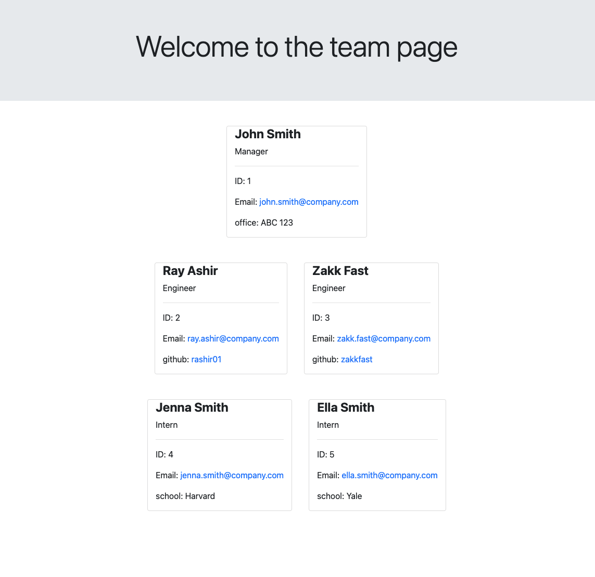

# Team Page Generator App

An app that can give a team manager easy access to team members' emails and links

## Table of Contents
[License](#license)

[Description](#description)

[Installation](#installation)

[Usage](#usage)

[Contributing](#contributing)

[Test](#test)

[Questions](#questions)
## License
This project is covered by the Apache license

[](https://opensource.org/licenses/Apache-2.0)
## Description
This is a HTML file generator. A user enters the details of the manager, engineers, and interns on the team. The app will generate a web page that lists the team memebers and the provided contact information. 

## Installation
To test the app you can run 
```
npm i
```

## Usage
To run the unit tests run 
```
npm test
```
To run the app run 
``` 
node index
```
and follow the prompts. 

## Running Tests Demo

## Running App Demo

## Sample HTML Page Output
See a sample output HTML page [here](./SAMPLE_INDEX.html)

## Questions
[Github rashir01](https://github.com/rashir01)

Email: ray.dev.seng@gmail.com
